Final\_Project
================
Jonathan Agyeman
April 22, 2019

``` r
library("rjags")
library("tidyverse")
```

##### Bayesian Analysis with Uninformative Priors

``` r
reg_model =
    "model{ 

        for(i in 1:length(n)){
                 
                 ##likelihood
             y[i] ~ dnorm(mu[i], inv.var)
                 

         ###model
                 mu[i] <- beta_0 + beta_1*possession[i] + beta_2*passes[i] + 
              beta_3*shot.accuracy[i] + beta_4*corners[i]+ beta_5*oppnt_poss[i]+beta_6*oppnt_pass[i] + beta_7*oppnt_shot.accuracy[i] + beta_8*oppnt_corners[i]
        } 
    
        beta_0 ~ dnorm(0, 0.2)
                beta_1 ~ dunif(0, 1)
                beta_2 ~ dpois(400)
                beta_3 ~ dunif(0,1)
                beta_4 ~ dpois(4)
        beta_5 ~ dunif(0, 1)
        beta_6 ~ dpois(400)
        beta_7 ~ dunif(0, 1)
        beta_8 ~ dpois(4)
        inv.var ~ dgamma(0.1,0.1)
        sigma <- 1/sqrt(inv.var)
            
}"
```

``` r
##Read manchesterunited data
manu <- read.csv("data.csv", header = TRUE)

my.seed <-123
set.seed(my.seed) 

inits <- list(.RNG.name = "base::Mersenne-Twister",
          .RNG.seed = my.seed)
 
jags.m1 <- jags.model( textConnection(reg_model), data = list( ###Put in data
    'n' = manu$Game.number,
    'y' = manu$Win.margin,
    'possession' = manu$possession,
    'passes' = manu$passes,
    'shot.accuracy' =manu$shot.accuracy,
    'corners' = manu$corners,
    'oppnt_poss' = manu$oppnt_poss,
    'oppnt_pass' = manu$oppnt_pass,
    'oppnt_shot.accuracy' =manu$oppnt_shot.accuracy,
    'oppnt_corners' = manu$oppnt_corners),
    inits = inits)
```

    ## Compiling model graph
    ##    Resolving undeclared variables
    ##    Allocating nodes
    ## Graph information:
    ##    Observed stochastic nodes: 152
    ##    Unobserved stochastic nodes: 10
    ##    Total graph size: 2335
    ## 
    ## Initializing model

``` r
samps <- coda.samples(jags.m1, c("beta_0","beta_1", "beta_2","beta_3",
                 "beta_4","beta_5", "beta_6", "beta_7",
                 "beta_8", "sigma"), n.iter = 10000)


summary(samps)
```

    ## 
    ## Iterations = 1001:11000
    ## Thinning interval = 1 
    ## Number of chains = 1 
    ## Sample size per chain = 10000 
    ## 
    ## 1. Empirical mean and standard deviation for each variable,
    ##    plus standard error of the mean:
    ## 
    ##              Mean        SD  Naive SE Time-series SE
    ## beta_0 -1.997e-02 2.258e+00 2.258e-02      2.258e-02
    ## beta_1  4.987e-01 2.897e-01 2.897e-03      3.429e-03
    ## beta_2  3.014e+02 1.935e+01 1.935e-01      2.735e-01
    ## beta_3  4.965e-01 2.861e-01 2.861e-03      3.331e-03
    ## beta_4  3.958e+00 1.968e+00 1.968e-02      2.182e-02
    ## beta_5  4.972e-01 2.896e-01 2.896e-03      3.406e-03
    ## beta_6  3.259e+02 1.908e+01 1.908e-01      2.382e-01
    ## beta_7  5.024e-01 2.883e-01 2.883e-03      3.373e-03
    ## beta_8  3.968e+00 1.981e+00 1.981e-02      2.130e-02
    ## sigma   2.950e+05 2.214e+04 2.214e+02      3.402e+02
    ## 
    ## 2. Quantiles for each variable:
    ## 
    ##              2.5%        25%        50%       75%     97.5%
    ## beta_0 -4.443e+00 -1.545e+00 -2.232e-02 1.529e+00 4.398e+00
    ## beta_1  2.627e-02  2.486e-01  4.958e-01 7.532e-01 9.749e-01
    ## beta_2  2.640e+02  2.890e+02  3.010e+02 3.140e+02 3.400e+02
    ## beta_3  2.569e-02  2.512e-01  4.941e-01 7.396e-01 9.750e-01
    ## beta_4  1.000e+00  3.000e+00  4.000e+00 5.000e+00 8.000e+00
    ## beta_5  2.421e-02  2.455e-01  4.946e-01 7.489e-01 9.747e-01
    ## beta_6  2.890e+02  3.130e+02  3.260e+02 3.390e+02 3.640e+02
    ## beta_7  2.681e-02  2.566e-01  5.023e-01 7.530e-01 9.749e-01
    ## beta_8  1.000e+00  3.000e+00  4.000e+00 5.000e+00 8.000e+00
    ## sigma   2.527e+05  2.800e+05  2.942e+05 3.091e+05 3.401e+05

``` r
##credible intervals 
print(HPDinterval(samps))
```

    ## [[1]]
    ##                lower        upper
    ## beta_0 -4.305909e+00 4.493088e+00
    ## beta_1  5.215812e-02 9.994958e-01
    ## beta_2  2.620000e+02 3.370000e+02
    ## beta_3  4.711328e-02 9.946877e-01
    ## beta_4  0.000000e+00 7.000000e+00
    ## beta_5  1.504348e-02 9.635837e-01
    ## beta_6  2.860000e+02 3.610000e+02
    ## beta_7  3.487888e-02 9.818107e-01
    ## beta_8  0.000000e+00 7.000000e+00
    ## sigma   2.497982e+05 3.370762e+05
    ## attr(,"Probability")
    ## [1] 0.95

``` r
##traceplots
par(mar =rep(2,4))
plot(samps)
```

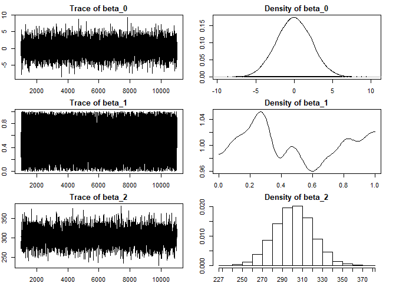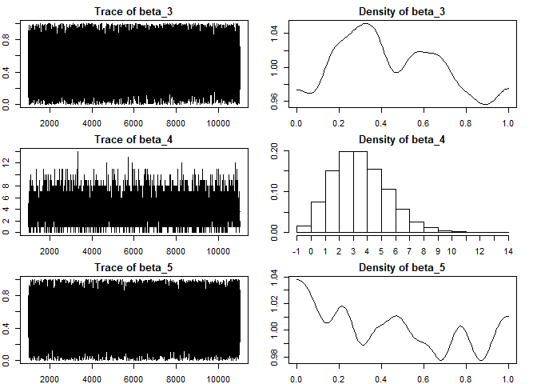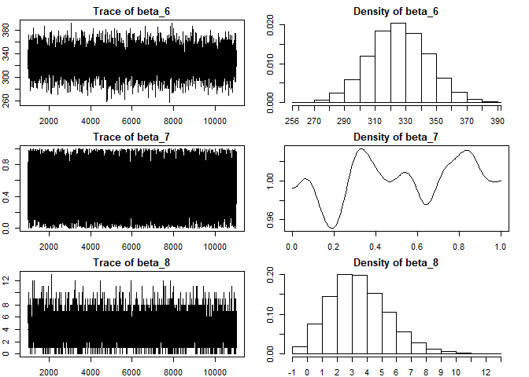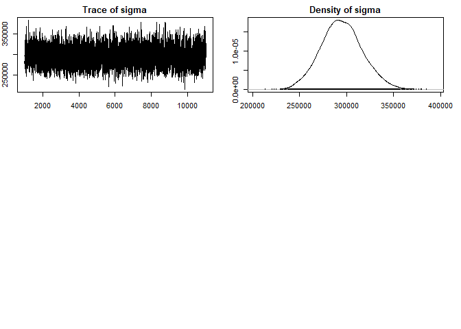

``` r
####Scaling data

poss_manu = (manu$possession - mean(manu$possession))/sd(manu$possession) 
pass_manu = (manu$passes - mean(manu$passes))/sd(manu$passes)
shot_acc_manu = (manu$shot.accuracy - mean(manu$shot.accuracy))/sd(manu$shot.accuracy)
corn_manu = (manu$corners - mean(manu$corners))/sd(manu$corners)
opp_poss_manu = (manu$oppnt_poss - mean(manu$oppnt_poss))/sd(manu$oppnt_poss)
opp_pass_manu = (manu$oppnt_pass - mean(manu$oppnt_pass))/sd(manu$oppnt_pass)
opp_shot_acc_manu =(manu$oppnt_shot.accuracy -  mean(manu$oppnt_shot.accuracy))/sd(manu$oppnt_shot.accuracy)
oppnt_corn_manu =(manu$oppnt_corners-mean(manu$oppnt_corners))/sd(manu$oppnt_corners)
```

``` r
###Combining scaled data
new_data <- cbind(manu, poss_manu, pass_manu, shot_acc_manu, corn_manu,
          opp_poss_manu, opp_pass_manu, opp_shot_acc_manu,
          oppnt_corn_manu)
#View(new_data)
```

##### Regression model with informative priors

``` r
reg_model1 =
    "model{ 

        for(i in 1:length(n)){
                 
                 ##likelihood
             y[i] ~ dnorm(mu[i], inv.var)
                 

         ###model
        mu[i] <- beta_0 + beta_1*possession[i] + beta_2*passes[i] + 
              beta_3*shot.accuracy[i] + beta_4*corners[i]+                      beta_5*oppnt_poss[i]+beta_6*oppnt_pass[i] + beta_7*oppnt_shot.accuracy[i] + beta_8*oppnt_corners[i]
        } 
    
        beta_0 ~ dnorm(0, 0.2)
                beta_1 ~ dnorm(0, 0.1)
                beta_2 ~ dnorm(0, 0.1)
                beta_3 ~ dnorm(0, 0.1)
                beta_4 ~ dnorm(0, 0.1)
        beta_5 ~ dnorm(0, 0.1)
        beta_6 ~ dnorm(0, 0.1)
        beta_7 ~ dnorm(0, 0.1)
        beta_8 ~ dnorm(0, 0.1)
        inv.var ~ dgamma(0.1,0.1)
        sigma <- 1/sqrt(inv.var)


        ###Prediction
                for(i in 1: length(nn)){
                Predicted_margin[i] <-  beta_0 + beta_1*posses1[i] + beta_2*passes1[i]          + beta_3*shot.accuracy1[i] + beta_4*corners1[i]+        
                beta_5*oppnt_poss1[i]+beta_6*oppnt_pass1[i] + 
                beta_7*oppnt_shot.accuracy1[i] +                            beta_8*oppnt_corners1[i]
}


            
}"
```

``` r
##Read manchesterunited data

##Subset training data
new_sub <- new_data[c(1:114),]

##Subset test data
new_predict <- new_data[c(115:152),]

my.seed <-123
set.seed(my.seed) 

inits <- list(.RNG.name = "base::Mersenne-Twister",
          .RNG.seed = my.seed)
 
jags.m1 <- jags.model( textConnection(reg_model1), data = list( ###Put in data
    'n' = new_sub$Game.number,
    'y' = new_sub$Win.margin,
    'possession' = new_sub$poss_manu,
    'passes' = new_sub$pass_manu,
    'shot.accuracy' =new_sub$shot_acc_manu,
    'corners' = new_sub$corn_manu,
    'oppnt_poss' = new_sub$opp_poss_manu,
    'oppnt_pass' = new_sub$opp_pass_manu,
    'oppnt_shot.accuracy' =new_sub$opp_shot_acc_manu,
    'oppnt_corners' = new_sub$oppnt_corn_manu,
    'nn' = new_predict$Game.number,
    'posses1' = new_predict$poss_manu,
    'passes1' = new_predict$pass_manu,
    'shot.accuracy1' =new_predict$shot_acc_manu,
    'corners1' = new_predict$corn_manu,
    'oppnt_poss1' = new_predict$opp_poss_manu,
    'oppnt_pass1' = new_predict$opp_pass_manu,
    'oppnt_shot.accuracy1' =new_predict$opp_shot_acc_manu,
    'oppnt_corners1' = new_predict$oppnt_corn_manu),
    inits = inits)
```

    ## Compiling model graph
    ##    Resolving undeclared variables
    ##    Allocating nodes
    ## Graph information:
    ##    Observed stochastic nodes: 114
    ##    Unobserved stochastic nodes: 10
    ##    Total graph size: 2295
    ## 
    ## Initializing model

``` r
samps1 <- coda.samples(jags.m1, c("beta_0","beta_1", "beta_2","beta_3",
                 "beta_4","beta_5", "beta_6", "beta_7","beta_8",
                 "sigma"), n.iter = 10000)

preds <- coda.samples(jags.m1,c("Predicted_margin"), n.iter = 10000)

summary(samps1)
```

    ## 
    ## Iterations = 1:10000
    ## Thinning interval = 1 
    ## Number of chains = 1 
    ## Sample size per chain = 10000 
    ## 
    ## 1. Empirical mean and standard deviation for each variable,
    ##    plus standard error of the mean:
    ## 
    ##            Mean      SD  Naive SE Time-series SE
    ## beta_0  0.46070 0.12385 0.0012385       0.001394
    ## beta_1  0.07406 0.42083 0.0042083       0.016765
    ## beta_2  0.47057 0.30168 0.0030168       0.011425
    ## beta_3  0.47513 0.11737 0.0011737       0.001174
    ## beta_4 -0.33501 0.13559 0.0013559       0.002042
    ## beta_5  0.54450 0.35932 0.0035932       0.012215
    ## beta_6 -0.31716 0.30455 0.0030455       0.011083
    ## beta_7 -0.81593 0.22460 0.0022460       0.002351
    ## beta_8 -0.06706 0.14843 0.0014843       0.002454
    ## sigma   1.27985 0.08834 0.0008834       0.001034
    ## 
    ## 2. Quantiles for each variable:
    ## 
    ##           2.5%     25%      50%      75%   97.5%
    ## beta_0  0.2187  0.3788  0.46041  0.54376  0.7051
    ## beta_1 -0.7469 -0.2136  0.07531  0.35938  0.8907
    ## beta_2 -0.1280  0.2672  0.47585  0.67441  1.0603
    ## beta_3  0.2408  0.3966  0.47692  0.55417  0.7064
    ## beta_4 -0.5972 -0.4259 -0.33536 -0.24298 -0.0709
    ## beta_5 -0.1647  0.3044  0.54955  0.78889  1.2380
    ## beta_6 -0.9018 -0.5248 -0.31980 -0.11692  0.2932
    ## beta_7 -1.2602 -0.9623 -0.81821 -0.66718 -0.3703
    ## beta_8 -0.3553 -0.1677 -0.06652  0.03344  0.2264
    ## sigma   1.1227  1.2178  1.27509  1.33617  1.4658

``` r
summary(preds)
```

    ## 
    ## Iterations = 10001:20000
    ## Thinning interval = 1 
    ## Number of chains = 1 
    ## Sample size per chain = 10000 
    ## 
    ## 1. Empirical mean and standard deviation for each variable,
    ##    plus standard error of the mean:
    ## 
    ##                         Mean     SD Naive SE Time-series SE
    ## Predicted_margin[1]  -0.5726 0.2359 0.002359       0.002594
    ## Predicted_margin[2]   0.9627 0.2789 0.002789       0.004827
    ## Predicted_margin[3]   0.1908 0.2631 0.002631       0.003974
    ## Predicted_margin[4]  -0.2635 0.3257 0.003257       0.004433
    ## Predicted_margin[5]   0.8352 0.3013 0.003013       0.004791
    ## Predicted_margin[6]   0.8081 0.2986 0.002986       0.004407
    ## Predicted_margin[7]   1.5037 0.4775 0.004775       0.004871
    ## Predicted_margin[8]   0.8064 0.3916 0.003916       0.005836
    ## Predicted_margin[9]   0.8949 0.5039 0.005039       0.005797
    ## Predicted_margin[10]  0.8776 0.2098 0.002098       0.002057
    ## Predicted_margin[11]  0.4843 0.2898 0.002898       0.003219
    ## Predicted_margin[12]  0.2893 0.2752 0.002752       0.003931
    ## Predicted_margin[13]  2.3475 0.3753 0.003753       0.004706
    ## Predicted_margin[14]  1.0885 0.2581 0.002581       0.004061
    ## Predicted_margin[15]  0.2343 0.2321 0.002321       0.002452
    ## Predicted_margin[16]  0.6781 0.2272 0.002272       0.003083
    ## Predicted_margin[17]  1.2020 0.2987 0.002987       0.003675
    ## Predicted_margin[18] -0.6771 0.3048 0.003048       0.004459
    ## Predicted_margin[19] -1.0495 0.3481 0.003481       0.004154
    ## Predicted_margin[20]  0.3027 0.1921 0.001921       0.002200
    ## Predicted_margin[21]  0.6953 0.2382 0.002382       0.004254
    ## Predicted_margin[22] -0.1785 0.3661 0.003661       0.006431
    ## Predicted_margin[23]  0.6845 0.4043 0.004043       0.004157
    ## Predicted_margin[24]  0.2324 0.5206 0.005206       0.006085
    ## Predicted_margin[25]  0.7690 0.3279 0.003279       0.005974
    ## Predicted_margin[26]  0.6560 0.2645 0.002645       0.003561
    ## Predicted_margin[27]  0.1833 0.2516 0.002516       0.003387
    ## Predicted_margin[28] -5.1172 1.3077 0.013077       0.014553
    ## Predicted_margin[29] -7.2680 1.9789 0.019789       0.022126
    ## Predicted_margin[30]  0.1278 0.3566 0.003566       0.005174
    ## Predicted_margin[31] -0.1239 0.3414 0.003414       0.004014
    ## Predicted_margin[32]  1.0542 0.1832 0.001832       0.002105
    ## Predicted_margin[33]  0.6350 0.3102 0.003102       0.004200
    ## Predicted_margin[34]  0.5305 0.2851 0.002851       0.003250
    ## Predicted_margin[35] -0.1468 0.2692 0.002692       0.003408
    ## Predicted_margin[36]  0.2858 0.1961 0.001961       0.002046
    ## Predicted_margin[37]  1.9270 0.2866 0.002866       0.003624
    ## Predicted_margin[38]  0.1464 0.3782 0.003782       0.005888
    ## 
    ## 2. Quantiles for each variable:
    ## 
    ##                           2.5%      25%     50%      75%    97.5%
    ## Predicted_margin[1]   -1.02844 -0.73173 -0.5709 -0.41499 -0.10911
    ## Predicted_margin[2]    0.42069  0.77710  0.9614  1.14499  1.51722
    ## Predicted_margin[3]   -0.32437  0.01463  0.1889  0.36804  0.71289
    ## Predicted_margin[4]   -0.89095 -0.48761 -0.2650 -0.04184  0.37348
    ## Predicted_margin[5]    0.24964  0.63563  0.8363  1.03415  1.43981
    ## Predicted_margin[6]    0.22666  0.61031  0.8075  1.00395  1.40253
    ## Predicted_margin[7]    0.57546  1.17873  1.5089  1.82325  2.42996
    ## Predicted_margin[8]    0.03845  0.54324  0.8046  1.07010  1.57150
    ## Predicted_margin[9]   -0.09518  0.55963  0.8979  1.22887  1.88596
    ## Predicted_margin[10]   0.46985  0.73624  0.8755  1.01759  1.29099
    ## Predicted_margin[11]  -0.08696  0.28831  0.4817  0.68048  1.06025
    ## Predicted_margin[12]  -0.24220  0.10180  0.2883  0.47491  0.82973
    ## Predicted_margin[13]   1.60907  2.09989  2.3474  2.59724  3.08222
    ## Predicted_margin[14]   0.57829  0.91586  1.0873  1.26320  1.58799
    ## Predicted_margin[15]  -0.22308  0.07805  0.2363  0.39151  0.67697
    ## Predicted_margin[16]   0.23347  0.52444  0.6789  0.83133  1.12347
    ## Predicted_margin[17]   0.62171  1.00539  1.2043  1.40271  1.78785
    ## Predicted_margin[18]  -1.26475 -0.88464 -0.6757 -0.47375 -0.07214
    ## Predicted_margin[19]  -1.73983 -1.28128 -1.0471 -0.81784 -0.36700
    ## Predicted_margin[20]  -0.07858  0.17357  0.3012  0.43031  0.68803
    ## Predicted_margin[21]   0.22362  0.53649  0.6949  0.85606  1.15901
    ## Predicted_margin[22]  -0.90345 -0.42026 -0.1732  0.06089  0.53861
    ## Predicted_margin[23]  -0.10022  0.41311  0.6814  0.96087  1.48469
    ## Predicted_margin[24]  -0.78285 -0.12022  0.2340  0.57894  1.25345
    ## Predicted_margin[25]   0.11979  0.54718  0.7694  0.98685  1.42031
    ## Predicted_margin[26]   0.14013  0.47640  0.6585  0.83275  1.17021
    ## Predicted_margin[27]  -0.30375  0.01596  0.1825  0.34975  0.68646
    ## Predicted_margin[28]  -7.71976 -5.98870 -5.1189 -4.22623 -2.59957
    ## Predicted_margin[29] -11.20714 -8.60359 -7.2616 -5.92932 -3.43956
    ## Predicted_margin[30]  -0.57612 -0.11229  0.1256  0.37026  0.82676
    ## Predicted_margin[31]  -0.79396 -0.35277 -0.1252  0.10294  0.54855
    ## Predicted_margin[32]   0.69631  0.93073  1.0551  1.17752  1.40449
    ## Predicted_margin[33]   0.03326  0.42745  0.6357  0.84234  1.23852
    ## Predicted_margin[34]  -0.03136  0.34060  0.5332  0.71741  1.09362
    ## Predicted_margin[35]  -0.67657 -0.32602 -0.1445  0.03045  0.38837
    ## Predicted_margin[36]  -0.09044  0.15420  0.2854  0.41850  0.67161
    ## Predicted_margin[37]   1.36659  1.73567  1.9278  2.12139  2.48541
    ## Predicted_margin[38]  -0.58864 -0.10420  0.1469  0.40119  0.89349

``` r
##Credible intervals
print(HPDinterval(samps1))
```

    ## [[1]]
    ##             lower       upper
    ## beta_0  0.2211307  0.70591714
    ## beta_1 -0.7472134  0.89048889
    ## beta_2 -0.1115730  1.07139670
    ## beta_3  0.2355219  0.69968774
    ## beta_4 -0.5915846 -0.06594678
    ## beta_5 -0.1553082  1.24497874
    ## beta_6 -0.9197105  0.26970879
    ## beta_7 -1.2529496 -0.36801312
    ## beta_8 -0.3593517  0.22197715
    ## sigma   1.1215578  1.46422487
    ## attr(,"Probability")
    ## [1] 0.95

``` r
##trace plots
par(mar =rep(2,4))
plot(samps1)
```

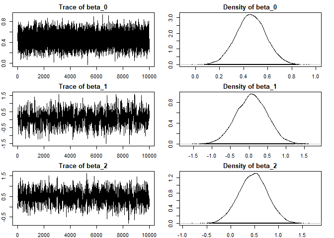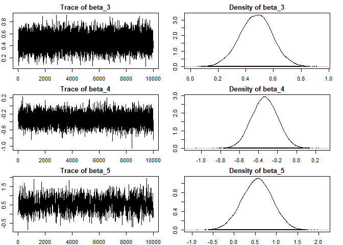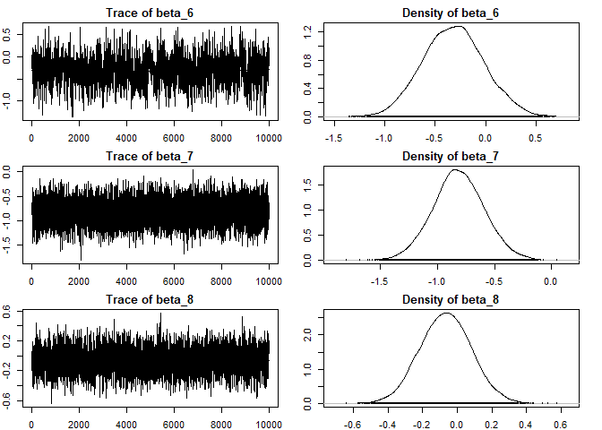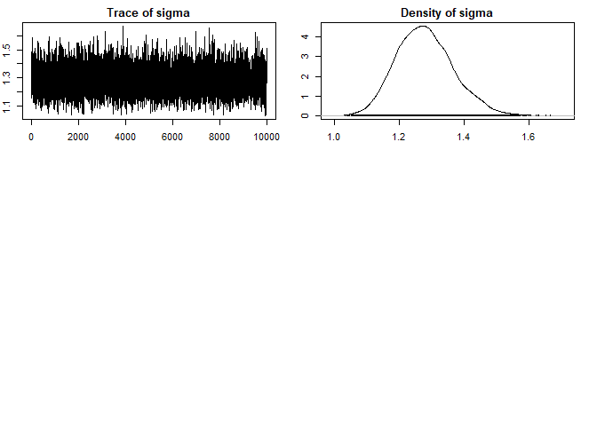

``` r
sampPred <- preds[[1]][,9]
plot(density(sampPred) , xlab = "", main  = "Predictive Posterior Distribution for\n Manchster United Win margin vrs Liverpool")
abline(v = 1, col = "red")
```

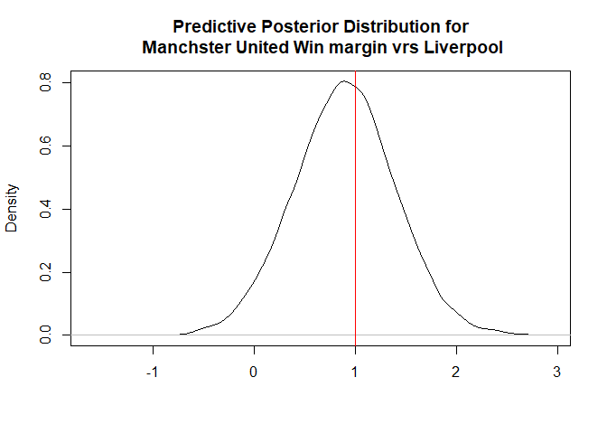

``` r
sampPred1 <- preds[[1]][,10]
plot(density(sampPred1) , xlab = "", main  = "Predictive Posterior Distribution for\n Manchster United Win margin vrs Crystal Palace")
abline(v = 1, col = "red")
```

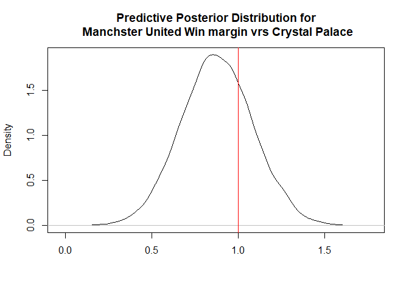

``` r
sampPred2 <- preds[[1]][,13]
plot(density(sampPred2) , xlab = "", main  = "Predictive Posterior Distribution for\n Manchster United Win margin vrs Huddersfield")
abline(v = 2, col = "red")
```

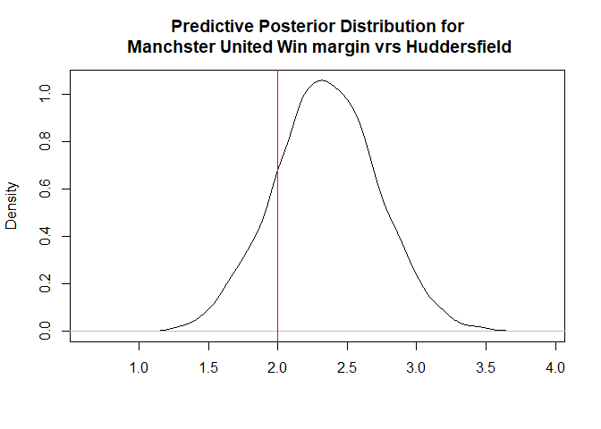

``` r
###linear regression frequentist

fit1 <- lm(Win.margin ~ poss_manu + pass_manu + shot_acc_manu + corn_manu+
        opp_poss_manu+ opp_pass_manu + opp_shot_acc_manu + oppnt_corn_manu,
                data = new_sub)

summary(fit1)
```

    ## 
    ## Call:
    ## lm(formula = Win.margin ~ poss_manu + pass_manu + shot_acc_manu + 
    ##     corn_manu + opp_poss_manu + opp_pass_manu + opp_shot_acc_manu + 
    ##     oppnt_corn_manu, data = new_sub)
    ## 
    ## Residuals:
    ##     Min      1Q  Median      3Q     Max 
    ## -4.0873 -0.6481  0.1009  0.7392  2.7484 
    ## 
    ## Coefficients:
    ##                   Estimate Std. Error t value Pr(>|t|)    
    ## (Intercept)        0.46023    0.12259   3.754 0.000286 ***
    ## poss_manu          0.05714    0.42900   0.133 0.894300    
    ## pass_manu          0.48659    0.30663   1.587 0.115540    
    ## shot_acc_manu      0.47750    0.11625   4.107 7.94e-05 ***
    ## corn_manu         -0.33211    0.13559  -2.449 0.015965 *  
    ## opp_poss_manu      0.56832    0.36564   1.554 0.123125    
    ## opp_pass_manu     -0.34073    0.31533  -1.081 0.282375    
    ## opp_shot_acc_manu -0.81989    0.22522  -3.640 0.000424 ***
    ## oppnt_corn_manu   -0.07013    0.15051  -0.466 0.642207    
    ## ---
    ## Signif. codes:  0 '***' 0.001 '**' 0.01 '*' 0.05 '.' 0.1 ' ' 1
    ## 
    ## Residual standard error: 1.272 on 105 degrees of freedom
    ## Multiple R-squared:  0.3151, Adjusted R-squared:  0.2629 
    ## F-statistic: 6.038 on 8 and 105 DF,  p-value: 2.244e-06

``` r
predicted <- predict(fit1, new_predict)

predicted
```

    ##        115        116        117        118        119        120 
    ## -0.5732638  0.9601674  0.1830878 -0.2683969  0.8273823  0.8017521 
    ##        121        122        123        124        125        126 
    ##  1.5066109  0.8011647  0.8934275  0.8785629  0.4837071  0.2890467 
    ##        127        128        129        130        131        132 
    ##  2.3484728  1.0845469  0.2361701  0.6798589  1.1996755 -0.6862072 
    ##        133        134        135        136        137        138 
    ## -1.0549331  0.3052599  0.6890088 -0.1910482  0.6840592  0.2326093 
    ##        139        140        141        142        143        144 
    ##  0.7794988  0.6605598  0.1777410 -5.1226371 -7.2784887  0.1219474 
    ##        145        146        147        148        149        150 
    ## -0.1266856  1.0533837  0.6355864  0.5330198 -0.1509849  0.2817703 
    ##        151        152 
    ##  1.9285868  0.1511588
